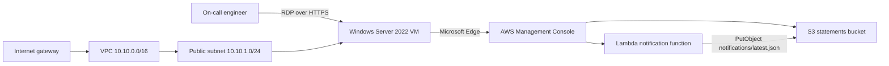

# AWS Payment Notification Troubleshooting

## Overview

Welcome to **AWS Payment Notification Troubleshooting**. You are the on-call cloud engineer for the fintech PAYNOTIFY service. After a change window, the service is failing because its Amazon S3 statements bucket and AWS Lambda notification function were deliberately misconfigured.

You will work in a disposable AWS environment in **US East (N. Virginia) (`us-east-1`)**. Use the Windows Server 2022 lab VM over RDP over HTTPS through CloudLabs, Microsoft Edge, and the AWS Management Console to investigate and repair the service.

The exercises are independent. Complete them in order for the smoothest experience, but a problem in one scenario does not prevent you from working on another. Use the AWS Management Console first; CLI commands are not required for the exercises.

## Objectives

By the end of this lab, you will be able to:

- Restore Amazon S3 Block Public Access and versioning settings.
- Remove an unwanted S3 bucket policy and upload an object under a prefix.
- Diagnose an AWS Lambda handler and environment-variable failure.
- Add a narrowly scoped Amazon S3 write policy to a Lambda execution role.
- Invoke a Lambda function with a test event and verify its S3 output.
- Apply foundational AWS networking concepts involving VPCs, subnets, security groups, network ACLs, gateways, DNS, and routing.

## Prerequisites

You should be comfortable with:

- Using Windows, Microsoft Edge, and Notepad.
- Navigating the AWS Management Console.
- Basic Amazon S3, AWS Lambda, IAM, VPC, and networking terminology.
- Reading a configuration error and verifying a successful result.

CloudLabs supplies the AWS console credentials, VM credentials, deployment ID, AWS Region, and validation context in the Environment tab.

## Architecture

The deployment contains one CloudFormation stage in `us-east-1`. It provisions a public VPC and a Windows Server 2022 VM for the hands-on work, together with the deliberately broken PAYNOTIFY resources.

### Provisioned resources

- One VPC with CIDR `10.10.0.0/16`.
- One public subnet with CIDR `10.10.1.0/24`, route table, default internet route, and internet gateway.
- A Windows Server 2022 VM with a t3-family instance type and an SSM instance profile.
- A learner VM security group and the reference cluster security group.
- One S3 bucket named <inject key="StatementsBucket" enableCopy="true"></inject>. No archive bucket is created.
- One Python 3.12 Lambda function named <inject key="LambdaFunctionName" enableCopy="true"></inject>.

The Lambda function initially has handler `index.handler`, although its source defines `lambda_handler`. Its `BUCKET_NAME` environment value points to the nonexistent `pn-statements-archive` bucket, and its execution role does not allow the required S3 write.

## Scenario breakdown

### Scenario 1 — Repair the PAYNOTIFY statements bucket

The statements bucket starts with all four S3 Block Public Access settings turned off, versioning disabled, and a `FreezeStatementUploads` bucket-policy deny on the `statements/*` path. You will restore the bucket settings, remove the seeded policy, and upload `test-statement.txt` beneath the `statements` prefix.

### Scenario 2 — Repair the PAYNOTIFY notification function

The notification function cannot run successfully because its handler setting does not match the source function. It also references the nonexistent archive bucket and lacks permission to write notifications. You will correct the handler and environment value, add the least-privilege S3 write policy to the Lambda execution role, invoke the function, and verify `notifications/latest.json`.

### Scenario 3 — Review PAYNOTIFY network basics

You will answer six single-choice troubleshooting questions about VPCs and subnets; security groups and network ACLs; internet and NAT gateways; and DNS and routing. Each question is worth 2 marks, for 12 marks total, with one retry.

## Scoring summary

- Scenario 1: validated S3 security settings, versioning, policy removal, and statement upload.
- Scenario 2: validated Lambda handler, bucket environment value, execution-role permission, successful invocation, and notification object.
- Scenario 3: six networking questions, 12 marks total, one retry.

Full completion requires both technical validations to succeed and all six questions to be answered according to the answer key.

## Environment details

Record these values before you begin:

| Item | Value |
|---|---|
| AWS Region | <inject key="Region" enableCopy="true"></inject> (<inject key="AwsRegion" enableCopy="true"></inject>) |
| CloudLabs deployment ID | <inject key="CloudLabsDeploymentID" enableCopy="true"></inject> |
| Statements bucket | <inject key="StatementsBucket" enableCopy="true"></inject> |
| Lambda function | <inject key="LambdaFunctionName" enableCopy="true"></inject> |

The resource names are deployment-specific. Do not substitute a similarly named bucket, function, or bucket from another AWS account.

## VM credentials

Use the credentials shown in the CloudLabs Environment tab:

- **VM user name:** <inject key="VMUserName" enableCopy="true"></inject>
- **VM password:** <inject key="VMPassword" enableCopy="true"></inject>

The VM is a Windows Server 2022 workstation. The bootstrap process creates the local administrator, enables the required remote access configuration, installs the workstation tools, creates an AWS Management Console shortcut, configures AmazonSSMAgent, and restarts the agent at the end of setup.

## Explore the environment

1. In the CloudLabs lab page, open the **Environment** tab.
2. Review the AWS console URL, AWS account information, Region, deployment ID, VM public connection details, and VM credentials.
3. Copy the statements bucket and Lambda function values from the Environment tab if you need to compare them with the values displayed in this guide.
4. Allow the VM bootstrap to finish before starting the exercises. If Edge or the console shortcut is not yet available, wait a few minutes and refresh the VM desktop.

## Sign in to AWS

1. Connect to the Windows Server 2022 VM using the VM details in the Environment tab.
2. On the VM desktop, open the **AWS Management Console** shortcut in Microsoft Edge. If you need to open it directly, browse to <inject key="AwsConsoleUrl"></inject>.
3. Sign in with the CloudLabs IAM user:
   - **IAM user name:** <inject key="IamUserName"></inject>
   - **IAM user password:** <inject key="IamUserPassword"></inject>
4. Confirm that the console Region selector shows **US East (N. Virginia)**. If it shows another Region, select `us-east-1` before opening S3, Lambda, IAM, or VPC resources.
5. Keep the AWS console open in Edge while you work. Use the account and Region supplied by CloudLabs; do not sign in with a personal AWS account.

## Split-window guidance

Use the VM for both the browser and the working files:

- Keep the AWS console in one Edge window and this lab guide in another window or tab.
- Snap Edge and the lab guide side by side when possible.
- Use Notepad on the VM desktop to create `test-statement.txt` for Scenario 1.
- Use the AWS console search bar to open **S3**, **Lambda**, **IAM**, or **VPC** rather than relying on an unfamiliar navigation layout.
- When a console page opens in a new tab, confirm the Region selector again before changing a resource.

## Managing the VM

Use the Windows VM only as the provided lab workstation. Do not stop, terminate, rename, or modify the VM, VPC, subnet, route table, internet gateway, or security groups unless an exercise explicitly asks you to inspect them. Do not create an archive bucket or unrelated AWS resources.

If the VM session disconnects, reconnect through the CloudLabs RDP over HTTPS experience and continue. If the console is unresponsive, refresh the Edge tab and verify the selected Region. Wait for a Lambda configuration update or invocation to finish before starting another operation.

## Support

If the environment does not load, credentials are missing, or the VM cannot be reached, use the CloudLabs support option provided by your training portal. Include the lab name, deployment ID <inject key="CloudLabsDeploymentID" enableCopy="true"></inject>, the exercise number, and the exact error message. Do not include passwords in a support request.

## After publishing

> [!Note] These steps run **after** you push the template to CloudLabs — they verify CloudLabs can actually serve this lab guide to candidates.

- **Verify docs-proxy access:** open Templates → your template → **Lab Guide Settings** in <https://admin.cloudlabs.ai> and confirm CloudLabs can reach this repo via the docs proxy. If the repo is private, configure GitHub access at the template level.
- **Verify inline questions and inline validations:** sign in to <https://admin.cloudlabs.ai>, open your template, and walk through one full lab run to confirm every `<question>` and `<validation step="..."/>` renders correctly. Fix any that don't resolve.
